# Enterprise RAG System

[](https://github.com/Karan-thayat/enterprise-rag-system/actions/workflows/ci.yml)

Ask questions about your PDFs and get answers that cite the exact pages they came from.

Documents are parsed, chunked, embedded and searched **locally on CPU**. Hybrid retrieval (BM25 + dense vectors, fused with Reciprocal Rank Fusion) and a cross-encoder reranker pick the passages; only those few passages, the question and recent chat turns are sent to an LLM (OpenAI's open-weight GPT-OSS 20B, served by Groq) to write the answer.

## Results

On a hand-labelled set of 40 questions about a 23-page research paper ([details](eval/results.md)):

| Retrieval pipeline | Hit@1 | Hit@3 | Hit@5 | MRR@10 |
|---|---:|---:|---:|---:|
| Original: 1,000-character windows, dense search | 27.5% | 52.5% | 57.5% | 0.423 |
| Current: sentence chunks, BM25 + dense (RRF), cross-encoder rerank | **77.5%** | **87.5%** | **95.0%** | **0.837** |

The original system sent its top 3 chunks to the LLM, which contained the answer for only 52.5% of questions. Most of the gain comes from hybrid search and reranking; reranking costs about 0.5 s per question on a laptop CPU. Chunking matters less: under the full pipeline, sentence chunks beat the original windows on Hit@1, Hit@5 and MRR but not on Hit@3, and their main benefits are page-level citations and embeddings that no longer lose the end of long chunks. With 40 questions, one question is worth 2.5 points, so small differences are within noise.

## Example

A real exchange with the sample paper indexed (live run, 30 Sep 2026):

> **Q:** How does MELODI's long-term memory differ from the Memorizing Transformer's?
>
> **A:** MELODI’s long‑term memory differs from the Memorizing Transformer’s in that MELODI stores compressed key‑value (KV) pairs rather than the raw KV pairs of the context tokens. This compression substantially reduces the size of the long‑term memory—e.g., compressing a 512‑token context window into 64 long‑term tokens yields an 8‑fold reduction in memory size [2].
>
> **[2]** melodi_iclr2025.pdf, page 6: “…a key distinction lies in the fact that MELODI stores compressed KV pairs, rather than the KV pairs of context tokens directly, as in MT. This modification substantially reduces the size of the long-term memory…”

Asked who won the 2022 FIFA World Cup, the same system replies “I couldn't find the answer in the uploaded documents.”

## Architecture

```mermaid
flowchart LR
    subgraph ingest["Ingestion: POST /upload"]
        direction TB
        U["PDF bytes"] --> V["Validate: extension, %PDF- header, size limit"]
        V --> H["doc_id = SHA-256 of the bytes; skip if already indexed"]
        H --> P["LiteParse: layout-aware text per page, Tesseract OCR"]
        P --> C["Sentence chunker: at most 200 MiniLM tokens, up to 40 tokens of overlap, page kept"]
        C --> E["all-MiniLM-L6-v2 embeddings (384-d, normalised)"]
    end

    E --> DB[("Chroma: cosine HNSW, ids doc_id:n, filename + page metadata")]
    DB -- "rebuilt after every upload or delete" --> BM[("BM25 index, in memory")]

    subgraph query["Question answering: POST /ask"]
        direction TB
        Q["Question + recent chat history"] --> RW["Follow-up? Rewrite it as a standalone query (LLM)"]
        RW --> D["Dense search: top 20"]
        RW --> K["BM25 search: top 20"]
        D --> F["Reciprocal Rank Fusion"]
        K --> F
        F --> X["Cross-encoder rerank: ms-marco-MiniLM-L-6-v2, keep top 4"]
        X --> G["Prompt: numbered sources with file and page, answer only from them"]
        G --> L["GPT-OSS 20B on Groq, low reasoning effort"]
        L --> A["Answer with [n] citations, sources, per-stage timings"]
    end

    DB --> D
    BM --> K
```



Parsing, embedding, search and reranking run on your machine. The Groq API only ever sees the question, the recent conversation and the four selected passages.

## Features

- **Layout-preserving parsing.** [LiteParse](https://github.com/run-llama/liteparse) places text by its coordinates on the page, so table rows and columns stay aligned in the extracted text, and OCR recovers text inside images.
- **Token-aware chunking.** Chunks are packed from whole sentences up to the embedding model's real limit, and neighbouring chunks share up to 40 tokens of whole sentences. The original fixed 1,000-character windows exceeded MiniLM's 256-token input for 23% of chunks, so their endings were silently dropped from the embedding.
- **Hybrid retrieval.** BM25 catches exact terms (model names, numbers, acronyms) that dense embeddings blur; RRF merges both rankings without score calibration.
- **Reranking.** A cross-encoder reads each question-passage pair jointly to order the 20 fused candidates.
- **Cited, grounded answers.** Sources are numbered `[1]`, `[2]`, … with file name and page, and the prompt instructs the model to answer only from them, cite them, or say the answer isn't in the documents. It also marks retrieved text as untrusted, a basic defence against instructions hidden inside documents.
- **Conversational follow-ups.** "What about its limitations?" is rewritten into a standalone query before retrieval, so the search looks for what the follow-up actually refers to.
- **Document management.** Uploads are de-duplicated by content hash; documents can be listed and deleted, and chunk IDs are namespaced per document so one upload can never overwrite another.
- **Responsive API.** Parsing, embedding and LLM calls run in FastAPI's thread pool, so a long upload doesn't stall other requests: a request sent during a 14-second upload now answers in 0.01 s, where the original `async` endpoints made it wait 12 s.

## Quickstart

Requires Python 3.12, Node.js 18+ (for the LiteParse CLI) and a free [Groq API key](https://console.groq.com). Tested on Linux; the pinned packages also publish wheels for macOS on Apple Silicon and for Windows x64, but those platforms are untested.

```bash
git clone https://github.com/Karan-thayat/enterprise-rag-system.git
cd enterprise-rag-system
python3.12 -m venv .venv             # Windows: py -3.12 -m venv .venv
source .venv/bin/activate            # Windows: .venv\Scripts\activate
pip install -r requirements.txt      # CPU-only PyTorch, no CUDA download
npm install -g @llamaindex/liteparse@2.15.0
cp .env.example .env                 # then set GROQ_API_KEY
```

No Python 3.12 on your system? With [uv](https://docs.astral.sh/uv/), run `uv venv --python 3.12 .venv` (uv downloads Python 3.12) and install with `uv pip install --index-strategy unsafe-best-match -r requirements.txt`; the flag lets uv combine PyPI with the CPU-only PyTorch index, as pip does.

Start the API and the UI in two terminals:

```bash
uvicorn app.main:app                 # http://127.0.0.1:8000, interactive docs at /docs
streamlit run frontend.py            # opens the chat UI in your browser
```

The first start downloads the embedding and reranking models (about 180 MB) from Hugging Face. Without `GROQ_API_KEY` the API still ingests and searches; only `/ask` returns 503.

## API

| Method | Path | Purpose |
|---|---|---|
| `POST` | `/upload` | Index a PDF (multipart field `file`). Returns the document's ID, pages and chunk count. |
| `POST` | `/ask` | `{"question": "...", "history": [{"role": "user", "content": "..."}]}` → answer, standalone query, numbered sources, timings |
| `POST` | `/search` | `{"query": "...", "top_k": 5}` → ranked passages, no LLM call |
| `GET` | `/documents` | List indexed documents |
| `DELETE` | `/documents/{doc_id}` | Remove a document and its chunks |
| `GET` | `/health` | Document and chunk counts, and whether the LLM is configured |

## Configuration

Settings are read from environment variables or `.env` (see [`.env.example`](.env.example)). The most useful ones:

| Variable | Default | Meaning |
|---|---|---|
| `GROQ_API_KEY` | none | Required for `/ask` |
| `RAG_LLM_MODEL` | `openai/gpt-oss-20b` | Groq chat model. Groq retired `llama-3.1-8b-instant` from its free and developer tiers on 16 Aug 2026 and recommends this one instead |
| `RAG_LLM_REASONING_EFFORT` | `low` | Reasoning effort for reasoning models; leave empty for models without reasoning |
| `RAG_TOP_K` | `4` | Passages given to the LLM |
| `RAG_CHUNK_MAX_TOKENS` / `RAG_CHUNK_OVERLAP_TOKENS` | `200` / `40` | Chunk size and overlap, in embedding-model tokens |
| `RAG_USE_HYBRID` / `RAG_USE_RERANKER` | `true` / `true` | Toggle BM25 fusion and reranking |
| `RAG_OCR_ENABLED` | `true` | OCR images while parsing; turning it off makes born-digital PDFs parse much faster |
| `RAG_MAX_UPLOAD_MB` | `25` | Upload size limit; the UI's own limit is `maxUploadSize` in `.streamlit/config.toml` |
| `RAG_API_URL` | `http://127.0.0.1:8000` | Where the Streamlit UI finds the API |

## Evaluation

`python -m eval.run_eval` rebuilds the index for each configuration and scores it against [`eval/golden_set.jsonl`](eval/golden_set.jsonl): 40 questions about the [MELODI paper](eval/data/melodi_iclr2025.pdf) (ICLR 2025), each labelled with verbatim evidence phrases and their page. The script first checks every phrase against the parsed PDF, so a labelling mistake stops the run instead of skewing the numbers. It writes [`eval/results.md`](eval/results.md), which also contains a chunk-size ablation.

The two questions the current pipeline still misses in the top 5 are recall failures: the answering passage ranks 51st or lower in both the dense and BM25 lists, so it never reaches the reranker. "What does the name MELODI stand for?" shares no words with the paper's "short for …" phrasing, and "Which research lab are the authors from?" requires knowing that Google DeepMind is a research lab.

## Tests

```bash
pip install -r requirements-dev.txt
pytest                    # 67 tests, offline: no models, parser CLI or API key needed
ruff check . && ruff format --check .
```

The tests swap in a hashing embedder, a fake parser and a fake Groq client. They cover chunking invariants, hybrid retrieval and RRF, citation prompts, follow-up rewriting, every API error path and the Streamlit UI (run headlessly with `AppTest`). GitHub Actions runs lint and tests on pushes to `main` and on pull requests.

## Project structure

```
app/
  main.py             FastAPI routes and error mapping
  pipeline.py         ingestion and question-answering orchestration
  document_parser.py  LiteParse wrapper (per-page text)
  chunking.py         sentence-aware, token-limited chunker
  embeddings.py       sentence-transformers wrapper
  vector_db.py        Chroma store with per-document IDs and metadata
  retrieval.py        BM25, Reciprocal Rank Fusion, cross-encoder reranker
  llm_generator.py    grounded prompt, citations, follow-up rewriting
  schemas.py          request and response models
  config.py           settings from environment variables
frontend.py           Streamlit chat UI
eval/                 golden question set, evaluation script, results
tests/                offline test suite
```

## Limitations and next steps

- **Single tenant, no authentication.** Every user shares one index; per-user collections and auth would come first for real deployment.
- **One process.** Chroma runs embedded and the BM25 index lives in memory, rebuilt after each upload, which is fine for thousands of chunks but not for horizontal scaling. A Chroma server or pgvector plus a search engine would replace both.
- **Answer quality isn't scored automatically yet.** The evaluation measures retrieval; faithfulness and citation accuracy of generated answers need an LLM-judged or human-labelled set.
- **Recall on paraphrased questions.** A stronger embedding model, a larger candidate pool or query expansion (e.g. HyDE) would target the misses above; running page headers could be stripped before indexing.
- **Side-by-side layouts.** Because LiteParse preserves the page's spatial layout, two text columns or a caption beside a paragraph come out interleaved line by line, which can split sentences across chunks.
- **No streaming or containerisation yet.** Answers arrive in one piece, and there is no Dockerfile.
